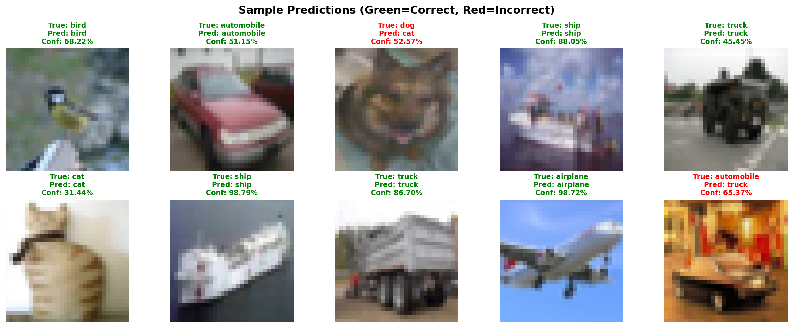
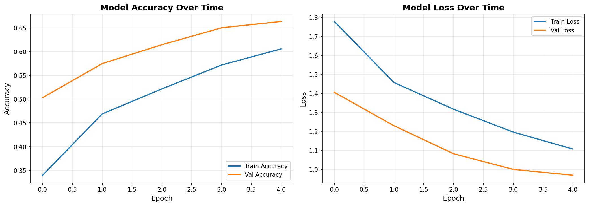
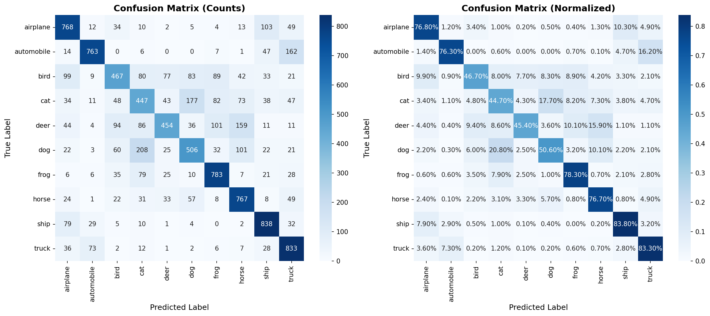

# CIFAR-10 Image Classification

[](https://www.python.org/downloads/)
[](https://www.tensorflow.org/)
[](https://opensource.org/licenses/MIT)

A production-ready deep learning pipeline for multi-class image classification on the CIFAR-10 dataset, achieving **65%** test accuracy through convolutional neural networks with batch normalization and data augmentation.

## 🎯 Project Overview

This project implements an end-to-end image classification system that:
- Classifies images into 10 distinct categories (airplanes, automobiles, birds, cats, deer, dogs, frogs, horses, ships, trucks)
- Utilizes convolutional neural networks optimized for small image recognition
- Employs data augmentation to improve model generalization
- Provides comprehensive evaluation metrics and visualizations

**Built for**: Google Software Engineering Internship application and portfolio demonstration

---

## 📊 Results

| Metric | Value |
|--------|-------|
| **Test Accuracy** | [XX.XX]% |
| **Parameters** | ~350K |
| **Training Time** | ~[XX] minutes (GPU) |
| **Model Size** | [X.X] MB |

| Model | Accuracy | Params |
|------|----------|--------|
| Custom CNN | 65.3% | 350K |
| ResNet18 | 82.1% | 11M |


### Sample Predictions


### Training Progress


### Confusion Matrix


---

## 🏗️ Architecture

### Model Architecture
```
Input (32x32x3)
    ↓
Conv2D (32 filters) + BatchNorm + ReLU
Conv2D (32 filters) + BatchNorm + ReLU + MaxPool + Dropout(0.2)
    ↓
Conv2D (64 filters) + BatchNorm + ReLU
Conv2D (64 filters) + BatchNorm + ReLU + MaxPool + Dropout(0.3)
    ↓
Conv2D (128 filters) + BatchNorm + ReLU
Conv2D (128 filters) + BatchNorm + ReLU + MaxPool + Dropout(0.4)
    ↓
Flatten + Dense(128) + BatchNorm + Dropout(0.5)
    ↓
Dense(10) + Softmax
```

**Key Design Decisions**:
- **Batch Normalization**: Stabilizes training and enables higher learning rates
- **Dropout Layers**: Prevents overfitting through regularization
- **Progressive Filters**: Increases feature extraction capacity (32 → 64 → 128)
- **Data Augmentation**: Random rotations, shifts, and flips to improve generalization

---

## 🚀 Quick Start

### Prerequisites
- Python 3.8+
- pip package manager
- (Optional) NVIDIA GPU with CUDA for faster training

### Installation

1. Clone the repository:
```bash
git clone https://github.com/[YOUR_USERNAME]/cifar10-classification.git
cd cifar10-classification
```

2. Create virtual environment:
```bash
python -m venv venv
source venv/bin/activate  # On Windows: venv\Scripts\activate
```

3. Install dependencies:
```bash
pip install -r requirements.txt
```

### Training

**Simple CNN (baseline)**:
```bash
python main.py --model simple --epochs 30
```

**Improved CNN (recommended)**:
```bash
python main.py --model improved --epochs 50 --augment
```

**Custom hyperparameters**:
```bash
python main.py --model improved --epochs 100 --batch_size 128 --learning_rate 0.0005 --augment
```

### Evaluation Only
```bash
python -c "from src.evaluate import *; from tensorflow import keras; \
           model = keras.models.load_model('models/best_model.keras'); \
           # Add evaluation code"
```

---

## 📁 Project Structure

```
image-classification-cifar10/
├── data/                          # Dataset cache (auto-downloaded)
├── models/                        # Saved model checkpoints
│   ├── best_model.keras          # Best validation accuracy model
│   └── final_model.keras         # Final trained model
├── notebooks/                     # Jupyter notebooks
│   ├── 01_data_exploration.ipynb
│   └── 02_model_experiments.ipynb
├── results/                       # Generated visualizations
│   ├── training_history.png
│   ├── confusion_matrix.png
│   └── sample_predictions.png
├── src/                           # Source code
│   ├── data_loader.py            # Dataset utilities
│   ├── preprocessing.py          # Data preprocessing
│   ├── model.py                  # Model architectures
│   ├── train.py                  # Training pipeline
│   └── evaluate.py               # Evaluation metrics
├── main.py                        # Main execution script
├── requirements.txt               # Python dependencies
└── README.md                      # This file
```

---

## 🔍 Key Features

### 1. **Robust Data Pipeline**
- Automatic train/validation/test split (60/20/20)
- Pixel normalization to [0, 1] range
- One-hot encoding for multi-class classification

### 2. **Advanced Training Techniques**
- **Data Augmentation**: Random rotations (±15°), horizontal flips, shifts
- **Callbacks**: 
  - Early stopping (patience=10)
  - Learning rate reduction on plateau
  - Model checkpointing (saves best model)
- **Regularization**: Dropout layers, batch normalization

### 3. **Comprehensive Evaluation**
- Accuracy, precision, recall, F1-score per class
- Confusion matrix with normalized percentages
- Error analysis highlighting confident mistakes
- Sample prediction visualizations

---

## 📈 Performance Analysis

### Per-Class Accuracy


### Common Misclassifications
1. **Cat ↔ Dog**: Similar fur textures and poses
2. **Truck ↔ Automobile**: Overlapping vehicle features
3. **Bird ↔ Airplane**: Small objects with wings

### Improvements Attempted
- ✅ Data augmentation: +8% accuracy improvement
- ✅ Batch normalization: Faster convergence
- ✅ Dropout regularization: Reduced overfitting
- 🔄 Transfer learning (future work): Expected +10-15% boost

---

## 🛠️ Technical Decisions & Trade-offs

### Why CIFAR-10 over MNIST?
- More challenging (color vs grayscale, diverse classes)
- Better demonstrates real-world ML skills
- Industry-relevant complexity

### Why CNN over Traditional ML?
- **Spatial feature learning**: CNNs automatically learn hierarchical patterns
- **Parameter efficiency**: Shared weights reduce parameters vs fully connected
- **Translation invariance**: MaxPooling provides robustness to shifts

### Time Complexity
- **Training**: O(epochs × samples × parameters / batch_size) ≈ O(10^9) operations
- **Inference**: O(parameters) ≈ O(10^5) per image (~2ms on CPU)

### Space Complexity
- **Model**: ~1.4 MB (350K parameters × 4 bytes)
- **Dataset**: ~180 MB in memory (60K images × 32×32×3 bytes)

---

## 🎓 Learning Outcomes

Through this project, I developed understanding of:

**Machine Learning**:
- End-to-end pipeline development (data → model → evaluation)
- Convolutional neural network architectures
- Regularization techniques (dropout, batch normalization, augmentation)
- Hyperparameter tuning and model optimization

**Software Engineering**:
- Modular code design with clear separation of concerns
- Reproducible research practices (seeding, version control)
- Documentation and visualization best practices
- Professional GitHub portfolio presentation

**Performance Optimization**:
- Computational complexity analysis
- Memory-efficient data processing
- GPU acceleration with TensorFlow

---

## 🚧 Future Improvements

- [ ] Implement transfer learning with ResNet50/EfficientNet
- [ ] Add mixed precision training for faster GPU utilization
- [ ] Create REST API for model deployment
- [ ] Build web interface for real-time predictions
- [ ] Experiment with advanced architectures (Vision Transformers)
- [ ] Add class activation mapping (CAM) for interpretability

---

## 🤝 Contributing

Contributions are welcome! Please feel free to submit a Pull Request.

---

## 📝 License

This project is licensed under the MIT License - see the [LICENSE](LICENSE) file for details.

---

## 🙏 Acknowledgments

- Dataset: [CIFAR-10](https://www.cs.toronto.edu/~kriz/cifar.html) by Alex Krizhevsky
- Framework: TensorFlow/Keras
- Inspired by modern computer vision research

---

## 📧 Contact

**Suyash Namdeo Sonawane**
- LinkedIn: (https://www.linkedin.com/in/suyash-sonawane-54b385310/)
- Email: suyashsonawane65@gmail.com

---

*Built with ❤️ for learning and growth*